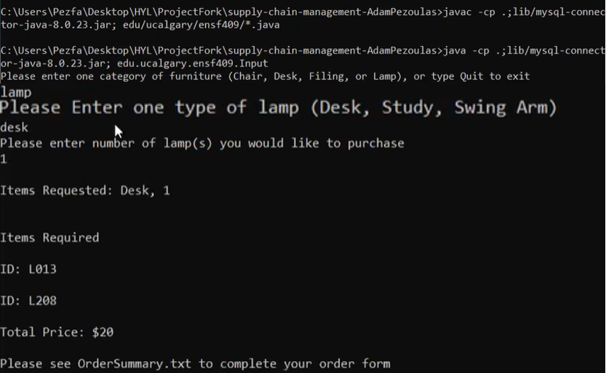

# Supply Chain Management

Programming Language: Java

Database: MySQL
## Installation

Please compile all java files in edu/ucalgary/ensf409 using mysql-connector-java-8.0.23.jar (in the lib folder), and run Input.java including the same connector. Command line examples are given below for Windows:

```bash
javac -cp .;lib/mysql-connector-java-8.0.23.jar; edu/ucalgary/ensf409/*.java

java -cp .;lib/mysql-connector-java-8.0.23.jar; edu.ucalgary.ensf409.Input

```
Please follow the prompts on screen to complete your order.
Upon completing your order the required items will be printed in the command window, or if the order cannot be completed manufacturer names will be provided.

OrderSummary.txt will also be created in the directory that was used to run the program, providing a convenient order form to be filled out.

The DBURL, USER, and PASS variables in input.java can be modified to access a different database than the default.

All unit tests are provided in edu/ucalgary/ensf409/UnitTests, and can be ran using the files located in the lib folder after being moved to the ensf409 folder. (They are in a separate folder to allow *.java, simplifying compilation)
## Purpose 
The Purpose of this project was to design an application to calculate the cheapest combination of available inventory items that can be used to fill a specific order. 
If the needed components are available, an order form is generated, and the furniture items is removed from inventory. The program takes in user input for furniture category, its type, and the number of items requested. Then cheapest option of furniture is calculated. 
When an order form is produced, the database gets updated to specify that the selected items are no longer available in inventory. 
If a request cannot be filled, the names of suggested manufacturers should be included in the output message 


## Images of the Project

<p align="center">
<alt="Material Bread logo">
 Figure 1- Customer ordering furniture called lamp of type desk
</p>

 
<p align="center">
<alt="Material Bread logo">
Figure 2- Textfile generated with order details
</p>

 
<p align="center">
<alt="Material Bread logo">
 Figure 3- Unsuccessful order
</p>
 
 
## Learned 
Learned to write unit tests using JUnit to ensure that the program would preform as expected 

 Gained exposure and confidence using MySQL database 

